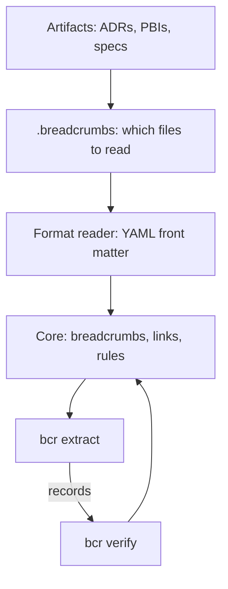

# The architecture of bcr

How the parts of `bcr` fit together, and what comes next. Every
decision named here is recorded elsewhere, in an ADR or a spec; this
page only links them. Read it before adding a command.

## What bcr is

`bcr` is the reference implementation of Breadcrumb. Only its core
domain is part of the method: the rules about what a breadcrumb holds
and what a set of breadcrumbs must satisfy
([ADR-0007](adrs/ADR-0007-core-domain.md)). Everything else, from
reading files to parsing flags, is infrastructure around that core,
and another implementation could do it differently. A file format
belongs to infrastructure too: the core holds meaning, not format
([ADR-0013](adrs/ADR-0013-core-holds-meaning-not-format.md)).

## Layers



| Layer | Package | Kind |
|---|---|---|
| Which files to read | `internal/fileset` | Infrastructure ([ADR-0014](adrs/ADR-0014-breadcrumbs-file-names-the-files-to-read.md)) |
| Front matter | `internal/frontmatter` | Infrastructure ([ADR-0010](adrs/ADR-0010-read-front-matter-with-go-yaml-v3.md)) |
| Records | `internal/records` | Infrastructure ([ADR-0011](adrs/ADR-0011-breadcrumbs-printed-as-tagged-records.md)) |
| Core | `internal/crumb` | Core domain ([ADR-0007](adrs/ADR-0007-core-domain.md)) |
| Commands | `cmd/bcr`, `internal/cli` | Infrastructure ([ADR-0006](adrs/ADR-0006-bcr-follows-posix-conventions.md)) |

The core imports only the standard library and reads no file. It is
given breadcrumbs, and each breadcrumb's place as text it only repeats
in messages.

## The pipeline

```
bcr extract | bcr verify
```

- `.breadcrumbs` names, by pattern, the files that carry breadcrumbs
  ([ADR-0014](adrs/ADR-0014-breadcrumbs-file-names-the-files-to-read.md)).
- `bcr extract` reads those files, or the files given as operands,
  checks each breadcrumb on its own, and prints it as tagged records
  ([`specs/extract`](../specs/extract/spec.md)).
- `bcr verify` reads those records and checks the rules about the whole
  set ([ADR-0015](adrs/ADR-0015-verify-reads-extract-records.md),
  [`specs/verify`](../specs/verify/spec.md)).

Records are the common language of the commands: one record per line,
its kind in the first field, and only `internal/records` knows their
format. A consumer selects records by kind and reads their fields by
position; new kinds, and new fields at the end of a record, may be
added.

In a pipe, the shell returns the exit status of the last command, so a
script that needs `bcr extract`'s status too runs with
`set -o pipefail`.

## Command families

| Family | Purpose | Commands | Status |
|---|---|---|---|
| Data | Turn files into records | `extract` | Done |
| Meaning | Judge the whole set of records | `verify` | Done, for the integrity of the graph |
| Feedback | Tell an author what is wrong, printing only problems | Not named | Reserved |
| Queries | Answer questions about the records | Not named | Open: a filter over the records may be enough |
| Cache | Store the records in `.bcr/` | `build` | Deferred |
| Old model | Audit `breadcrumbs/` | `check`, `verdict`, `links`, `new`, `spec`, `init`, `audit-report` | Until the old model is frozen |

A new command takes its name from what its family does: `extract`
produces data, `verify` judges it. Names the old model uses are not
reused while it runs.

## Rules every command follows

- One static Go binary per operating system
  ([ADR-0004](adrs/ADR-0004-one-go-binary.md)).
- Each module `bcr` requires directly enters through an ADR
  ([ADR-0005](adrs/ADR-0005-dependencies-enter-through-adr.md)).
- POSIX command-line conventions: getopt flags, results on standard
  output, problems as `PATH:LINE: MESSAGE` on standard error, exit
  status 0, 1 or 2
  ([ADR-0006](adrs/ADR-0006-bcr-follows-posix-conventions.md)).
- A format's rules live in its reader; a breadcrumb's meaning lives in
  the core ([ADR-0013](adrs/ADR-0013-core-holds-meaning-not-format.md)).
- Files come from operands, or from `.breadcrumbs`; a command that
  judges the whole set reads records, not files
  ([ADR-0014](adrs/ADR-0014-breadcrumbs-file-names-the-files-to-read.md),
  [ADR-0015](adrs/ADR-0015-verify-reads-extract-records.md)).

## Adding a command

1. Place it in a family, and name it from what the family does.
2. Write its spec in `specs/<command>/spec.md`
   ([`specs/asdlc`](../specs/asdlc/spec.md), Architecture).
3. Decide whether it reads files, through `internal/fileset` and a
   format reader, or records, through `internal/records`.
4. Put every new rule about breadcrumbs in `internal/crumb`, and
   nothing else there.
5. Record each decision the spec cannot hold in an ADR, one decision
   per ADR.
6. Describe it under `### <command>` in `docs/bcr.md`, and generate
   `docs/bcr.1` again
   ([ADR-0008](adrs/ADR-0008-user-documentation-in-docs-bcr-md.md),
   [ADR-0009](adrs/ADR-0009-man-page-generated-from-user-documentation.md)).

## Deferred, and what brings it back

| Deferred | Decided | Comes back when |
|---|---|---|
| The `.bcr/` cache: the records committed as tables | 2026-10-04 | A query is too slow over `bcr extract`'s records, or the graph's history is needed and running `bcr extract` on each past commit cannot give it |
| Claims and verdicts in `bcr verify` | 2026-10-04 | The work on claims starts; until then `bcr verify` checks only the integrity of the graph |
| Keys under `breadcrumb` other than `id`, `type` and `links` | 2026-10-03 | The first such key is proposed |

## The old model

`breadcrumbs/` holds the intakes, requirements, decisions and tasks
from before [ADR-0001](adrs/ADR-0001-adopt-asdlc.md), and the old
commands still read it. They are kept until a freeze ADR says what
happens to the folder and to its audit. Their names stay taken until
then, which is why the new set check is `verify`, not `check`.

## What comes next

1. Run `bcr extract | bcr verify` where agents and pull requests run
   checks.
2. Freeze the old model, and decide what becomes of its commands.
3. Read claims, the first check that can turn red because code moved
   away from a spec.
4. Queries, as a command only where a filter over the records is not
   enough.
