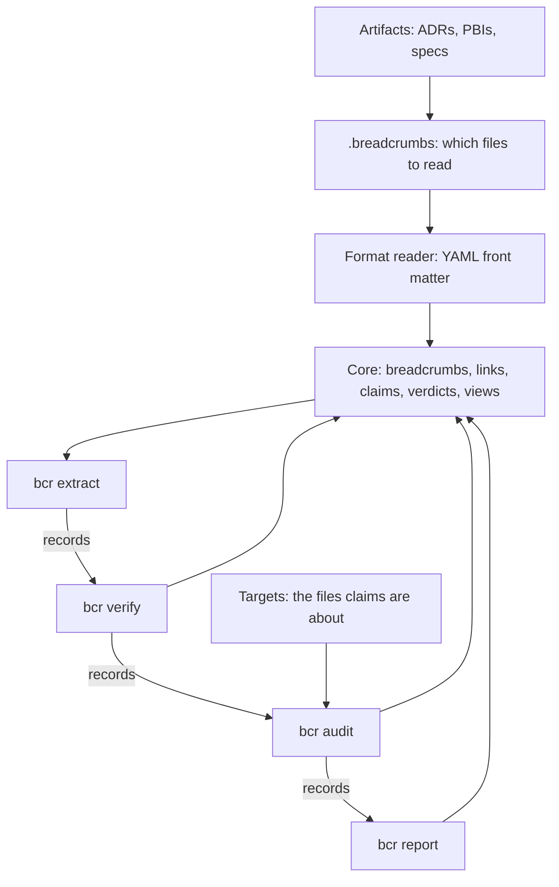

# The architecture of bcr

How the parts of `bcr` fit together, and what comes next. Every
decision named here is recorded elsewhere, in an ADR or a spec; this
page only links them. Read it before adding a command.

## What bcr is

`bcr` is the reference implementation of Breadcrumb. Only its core
domain is part of the method: the rules about what a breadcrumb holds
and what a set of breadcrumbs must satisfy
([ADR-0007](docs/adrs/ADR-0007-core-domain.md)). Everything else, from
reading files to parsing flags, is infrastructure around that core,
and another implementation could do it differently. A file format
belongs to infrastructure too: the core holds meaning, not format
([ADR-0013](docs/adrs/ADR-0013-core-holds-meaning-not-format.md)).

## Layers



| Layer | Package | Kind |
|---|---|---|
| Which files to read | `internal/fileset` | Infrastructure ([ADR-0014](docs/adrs/ADR-0014-breadcrumbs-file-names-the-files-to-read.md)) |
| Front matter | `internal/frontmatter` | Infrastructure ([ADR-0010](docs/adrs/ADR-0010-read-front-matter-with-go-yaml-v3.md)) |
| Records | `internal/records` | Infrastructure ([ADR-0011](docs/adrs/ADR-0011-breadcrumbs-printed-as-tagged-records.md)) |
| Targets | `internal/target` | Infrastructure ([ADR-0023](docs/adrs/ADR-0023-audit-checks-claims-against-the-working-tree.md)) |
| The report's page | `internal/page` | Infrastructure ([`specs/report`](specs/report/spec.md)) |
| Core | `internal/crumb` | Core domain ([ADR-0007](docs/adrs/ADR-0007-core-domain.md)) |
| Commands | `cmd/bcr`, `internal/cli` | Infrastructure ([ADR-0006](docs/adrs/ADR-0006-bcr-follows-posix-conventions.md)) |

The core imports only the standard library and reads no file. It is
given breadcrumbs, their claims and the content of the files the
claims are about, and each breadcrumb's place as text it only repeats
in messages.

## The pipeline

```
bcr extract | bcr verify | bcr audit | bcr report
```

- `.breadcrumbs` names, by pattern, the files that carry breadcrumbs
  ([ADR-0014](docs/adrs/ADR-0014-breadcrumbs-file-names-the-files-to-read.md)).
- `bcr extract` reads those files, or the files given as operands,
  checks each breadcrumb on its own, and prints it, its links and its
  claims as tagged records
  ([`specs/extract`](specs/extract/spec.md),
  [ADR-0017](docs/adrs/ADR-0017-claims-written-under-breadcrumb-key.md)).
- `bcr verify` reads those records and checks the rules about the whole
  set ([ADR-0015](docs/adrs/ADR-0015-verify-reads-extract-records.md),
  [`specs/verify`](specs/verify/spec.md)).
- `bcr audit` checks each claim against the working tree, and gives
  each claim and each breadcrumb a verdict: a breadcrumb's verdict is
  the AND of its own claims
  ([ADR-0022](docs/adrs/ADR-0022-verdict-is-the-and-of-own-claims.md),
  [ADR-0023](docs/adrs/ADR-0023-audit-checks-claims-against-the-working-tree.md),
  [`specs/audit`](specs/audit/spec.md)).
- `bcr report` ends the pipe with one Markdown page, its diagrams in
  Mermaid ([`specs/report`](specs/report/spec.md)).

Records are the common language of the commands: one record per line,
its kind in the first field, and only `internal/records` knows their
format. A consumer selects records by kind and reads their fields by
position; new kinds, and new fields at the end of a record, may be
added. Every stage but the last passes every record it reads on, byte
for byte
([ADR-0016](docs/adrs/ADR-0016-verify-passes-on-every-record.md)), and
a problem travels down the pipe as a record as well as on standard
error ([ADR-0021](docs/adrs/ADR-0021-problems-travel-as-records.md)).

In a pipe, the shell returns the exit status of the last command, and
`bcr report` exits 0 whatever the verdicts. A script that needs a
stage's status, such as `bcr audit`'s 1 for a Refuted claim, runs with
`set -o pipefail`.

## Command families

| Family | Purpose | Commands | Status |
|---|---|---|---|
| Data | Turn files into records | `extract` | Done |
| Meaning | Judge the records | `verify`, `audit` | Done: the integrity of the graph, and claims |
| Presentation | Show the records to a person | `report` | Done |
| Setup | Set a repository up for the pipe | `init` | Done ([`specs/init`](specs/init/spec.md)) |
| Feedback | Tell an author what is wrong, printing only problems | Not named | Reserved |
| Queries | Answer questions about the records | Not named | Open: a filter over the records may be enough |
| Cache | Store the records in `.bcr/` | `build` | Deferred |

A new command takes its name from what its family does: `extract`
produces data, `verify` and `audit` judge it, `report` shows it, and
`init` sets the pipe up. `init` reads no breadcrumb and no record, so
nothing of it is in the core.

## Rules every command follows

- One static Go binary per operating system
  ([ADR-0004](docs/adrs/ADR-0004-one-go-binary.md)).
- Each module `bcr` requires directly enters through an ADR
  ([ADR-0005](docs/adrs/ADR-0005-dependencies-enter-through-adr.md)).
- POSIX command-line conventions: getopt flags, results on standard
  output, problems as `PATH:LINE: MESSAGE` on standard error, exit
  status 0, 1 or 2
  ([ADR-0006](docs/adrs/ADR-0006-bcr-follows-posix-conventions.md)).
- A format's rules live in its reader; a breadcrumb's meaning lives in
  the core ([ADR-0013](docs/adrs/ADR-0013-core-holds-meaning-not-format.md)).
- Files come from operands, or from `.breadcrumbs`; a command that
  judges the whole set reads records, not files
  ([ADR-0014](docs/adrs/ADR-0014-breadcrumbs-file-names-the-files-to-read.md),
  [ADR-0015](docs/adrs/ADR-0015-verify-reads-extract-records.md)).
- A key added under `breadcrumb` is optional
  ([ADR-0018](docs/adrs/ADR-0018-new-breadcrumb-keys-are-optional.md)),
  and a released kind of claim keeps its meaning: a new meaning is a
  new kind
  ([ADR-0020](docs/adrs/ADR-0020-a-released-kind-of-claim-keeps-its-meaning.md)).

## Adding a command

1. Place it in a family, and name it from what the family does.
2. Write its spec in `specs/<command>/spec.md`
   ([`specs/asdlc`](specs/asdlc/spec.md), Architecture).
3. Decide whether it reads files, through `internal/fileset` and a
   format reader, or records, through `internal/records`.
4. Put every new rule about breadcrumbs in `internal/crumb`, and
   nothing else there.
5. Record each decision the spec cannot hold in an ADR, one decision
   per ADR.
6. Describe it under `### <command>` in `docs/bcr.md`, and generate
   `docs/bcr.1` again
   ([ADR-0008](docs/adrs/ADR-0008-user-documentation-in-docs-bcr-md.md),
   [ADR-0009](docs/adrs/ADR-0009-man-page-generated-from-user-documentation.md)).

## Deferred, and what brings it back

| Deferred | Decided | Comes back when |
|---|---|---|
| The `.bcr/` cache: the records committed as tables | 2026-10-04 | A query is too slow over `bcr extract`'s records, or the graph's history is needed and running `bcr extract` on each past commit cannot give it |
| Verdicts that travel along links | 2026-10-07 | A real case needs a Refuted claim to reach the breadcrumbs that link to it ([ADR-0022](docs/adrs/ADR-0022-verdict-is-the-and-of-own-claims.md)) |
| Kinds of claim other than `has-line` | 2026-10-07 | A spec needs a claim `has-line` cannot state; each new kind gets its own name and ADR ([ADR-0020](docs/adrs/ADR-0020-a-released-kind-of-claim-keeps-its-meaning.md)) |

## What comes next

1. Release the new model as v0.8.0.
2. Queries, as a command only where a filter over the records is not
   enough.
