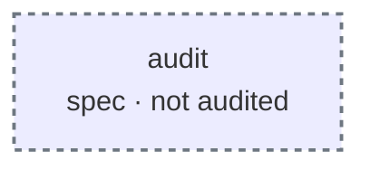
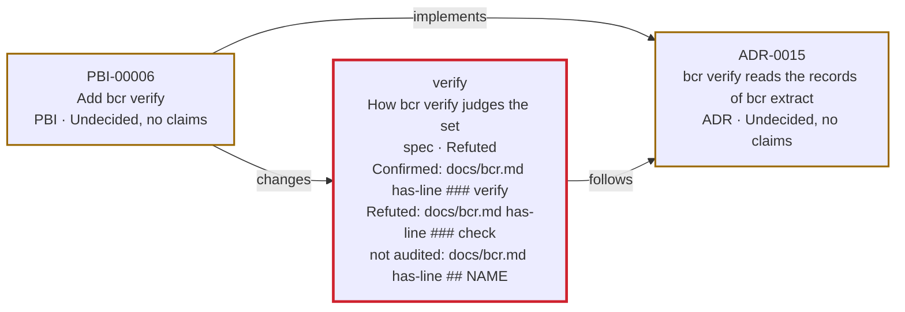

# Breadcrumb report

## Breadcrumbs

Breadcrumbs: 5. Refuted: 1. Undecided: 2. Confirmed: 1. Not audited: 1.

| Verdict | Breadcrumb | Type | File |
|---|---|---|---|
| Refuted | verify | spec | specs/verify/spec.md:3 |
| Undecided, no claims | ADR-0015 | ADR | docs/adrs/ADR-0015.md:3 |
| Undecided, no claims | PBI-00006 | PBI | tasks/PBI-00006.md:3 |
| Confirmed | ADR-0004 | ADR | docs/adrs/ADR-0004.md:3 |
| not audited | audit | spec | specs/audit/spec.md:3 |

## Problems

- docs/adrs/ADR-0099.md:2: breadcrumb has no id
- specs/verify/spec.md:11: claim "docs/bcr.md" must be a target, a kind and an argument

## Claims

| Verdict | Breadcrumb | Claim | File |
|---|---|---|---|
| Refuted | verify | docs/bcr.md has-line \#\#\# check | specs/verify/spec.md:9 |
| Confirmed | verify | docs/bcr.md has-line \#\#\# verify | specs/verify/spec.md:8 |
| not audited | verify | docs/bcr.md has-line \#\# NAME | specs/verify/spec.md:10 |

## Views

### audit

### verify

