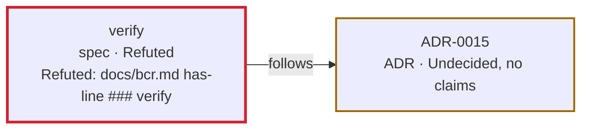

---
breadcrumb:
  id: report
  type: spec
  links:
    - follows ADR-0006
    - follows ADR-0007
    - follows ADR-0008
    - follows ADR-0011
    - follows ADR-0013
    - follows ADR-0016
    - follows ADR-0021
    - follows ADR-0022
    - follows ADR-0023
---
# Feature: report

`bcr report` reads the records the pipe carries and prints one page:
every breadcrumb with its verdict, every problem, every claim, and one
diagram for each spec.

## Blueprint

### Context

`bcr extract`, `bcr verify` and `bcr audit` print records, one line
each. They say everything the pipe found, and nobody reads them as
they are. `bcr report` is the last stage, and turns them into a page a
person reads:

```
bcr extract | bcr verify | bcr audit | bcr report > report.md
```

The page is Markdown, and its diagrams are Mermaid. `bcr` writes each
diagram as text and holds no layout code: GitHub, or any viewer of
Mermaid, lays it out.

The whole graph of a repository is too dense to read as one diagram,
so the page draws one view for each spec: the spec and what stands one
link away from it. A breadcrumb that is in no view is still on the
page, in the table that comes first. Nothing the records say is left
out.

`bcr report` judges nothing. A verdict on the page is one `bcr audit`
printed; a breadcrumb that got none is shown as `not audited`, so the
page can be made before `bcr audit` runs.

The old `bcr audit-report` stays as it is, for `breadcrumbs/`.

### Architecture

| Part | Does | Kind (ADR-0007) |
|---|---|---|
| Command | Reads standard input, writes the page to standard output, sets the exit status | Infrastructure |
| Record reader, `internal/records` | Turns each line of input into a breadcrumb, a link, a claim, a problem or a verdict; reports a line that is not a record | Infrastructure |
| Core, `internal/crumb` | Says which breadcrumbs and links are in the view of a spec, which claims are a breadcrumb's, which verdict was given to each, and the order by id | Core domain |
| Page writer, `internal/page` | Writes the page: its Markdown and its Mermaid, with their escaping | Infrastructure |

- The core imports only the standard library, and knows no format:
  not that of records, of Markdown or of Mermaid (ADR-0007, ADR-0013).
- `internal/page` is the only package that knows Markdown and Mermaid.
  It does not read records, and decides nothing about what is in a
  view.
- `bcr report` reads no file of the repository and runs no command.

### Interface

```
bcr report
```

`bcr report` takes no operand. It reads records from standard input
until it ends, as `bcr extract`, `bcr verify` and `bcr audit` print
them (`specs/extract/spec.md`, `specs/verify/spec.md`,
`specs/audit/spec.md`), and reads six kinds:

```
breadcrumb	ID	TYPE	PATH	LINE
link	ID	VERB	OBJECT	PATH	LINE
claim	ID	KIND	TARGET	ARGUMENT	PATH	LINE
problem	PATH	LINE	MESSAGE
claim-verdict	ID	VERDICT	PATH	LINE
verdict	ID	VERDICT	PATH	LINE
verdict	ID	VERDICT	PATH	LINE	REASON
```

- A record of another kind is not read (ADR-0011).
- Fields after the ones above are not read, since new fields may be
  added at the end of a record.
- A line of input may end in `\n` or `\r\n`. The last line need not
  end.
- A `breadcrumb`, a `claim-verdict` and a `verdict` record have at
  least five fields, a `link` record at least six, a `claim` record at
  least seven and a `problem` record at least four. None of the fields
  above is empty, `REASON` apart, and `LINE` is a whole number from 1,
  written in digits only.
- A `claim` record's `TARGET`, `KIND` and `ARGUMENT` follow the rules
  `bcr audit` checks (`specs/audit/spec.md`).
- `VERDICT` is `Confirmed`, `Refuted` or `Undecided`, byte for byte.
- A line whose first field is empty has no kind, and is not a record.
- A line that is not a record the pipe could print, an empty line
  included, stops `bcr report`: it writes a message starting `bcr: `
  that gives the line's number in the input, prints nothing to
  standard output, and exits 2.

What belongs to what, as in `bcr audit` (ADR-0021, ADR-0022,
ADR-0023):

- A claim, a link and a problem belong to the `breadcrumb` record that
  has their `PATH`. Their `ID` field is shown, and joins nothing.
- A link points to every `breadcrumb` record whose `ID` is its
  `OBJECT`, byte for byte.
- A `verdict` record gives its verdict to the `breadcrumb` record with
  the same `PATH` and `LINE`, and a `claim-verdict` record to the
  `claim` record with the same `PATH` and `LINE`. When two give one,
  the one read last holds.
- A breadcrumb or a claim that was given no verdict is `not audited`.

A verdict is written on the page as:

| Given | Written |
|---|---|
| `Confirmed`, `Refuted` or `Undecided` | The same word |
| `Undecided` with a `REASON` | `Undecided, REASON`, as in `Undecided, no claims` |
| None | `not audited` |

The order by id is used throughout: `ID` compared as bytes, then
`PATH` compared as bytes, then `LINE`. The order by verdict is
Refuted, Undecided, Confirmed, not audited.

`bcr report` prints only the page, not the records it read. The page
is, in this order:

````
# Breadcrumb report

## Breadcrumbs

Breadcrumbs: 3. Refuted: 1. Undecided: 1. Confirmed: 1. Not audited: 0.

| Verdict | Breadcrumb | Type | File |
|---|---|---|---|
| Refuted | verify | spec | specs/verify/spec.md:3 |
| Undecided, no claims | ADR-0015 | ADR | docs/adrs/ADR-0015.md:3 |
| Confirmed | audit | spec | specs/audit/spec.md:3 |

## Problems

- specs/verify/spec.md:9: claim must be written in single quotes

## Claims

| Verdict | Breadcrumb | Claim | File |
|---|---|---|---|
| Refuted | verify | docs/bcr.md has-line \#\#\# verify | specs/verify/spec.md:8 |

## Views

### verify


````

- **Breadcrumbs.** One line of counts, then one row for each
  `breadcrumb` record, in the order by verdict and then by id. `File`
  is the record's `PATH:LINE`. With no `breadcrumb` record, the
  section holds the line `No breadcrumbs.` and nothing else.
- **Problems.** One item for each `problem` record, as
  `PATH:LINE: MESSAGE`, in order of `PATH` compared as bytes, then of
  `LINE`, then as read. With none, the line `No problems.`.
- **Claims.** One row for each `claim` record, in the order by verdict
  and then by id. `Breadcrumb` is the record's `ID`, `Claim` is
  `TARGET KIND ARGUMENT`, and `File` is `PATH:LINE`. A claim whose
  `PATH` no breadcrumb has is listed like any other. With none, the
  line `No claims.`.
- **Views.** One view for each `breadcrumb` record whose `TYPE` is
  `spec`, byte for byte, in the order by id. Its heading is the spec's
  `ID`. With none, the line `No specs.`.
- Sections are separated by one empty line. The page ends in `\n`.

A view holds:

- the spec;
- every breadcrumb that has a link pointing to the spec;
- every breadcrumb a link of the spec points to;
- every link that belongs to one of those and points to another of
  them, once for each pair of breadcrumbs and `VERB`.

A link whose `OBJECT` is no breadcrumb's `ID` draws nothing; the
problem `bcr verify` printed for it is under Problems. A breadcrumb two
links away from the spec is not in its view.

A view is written as one Mermaid `flowchart LR`, in this order:

1. One box for each breadcrumb, in the order by id. Its name is `n1`,
   `n2` and so on, counted again in each view. Its label has one line
   for the `ID`, one for `TYPE · VERDICT`, and then one for each of
   its claims, in the order read, as `VERDICT: TARGET KIND ARGUMENT`.
   Lines are joined by `<br/>`.
2. One arrow for each link, from the breadcrumb it belongs to, to the
   one it points to, labelled with its `VERB`. Arrows are in the order
   of the box they leave, then of the box they reach, then of `VERB`
   compared as bytes.
3. The four `classDef` lines above, always the same.
4. One `class` line for each box, in the order of the boxes, with
   `refuted`, `undecided`, `confirmed` or `unaudited`.

Escaping. A repository chooses its own ids, paths, verbs and claims,
and a message quotes them, so each value read from a record is written
so that it cannot end, or change, the Markdown or the Mermaid around
it:

- In Markdown, each of `` \ ` * _ [ ] < > # | & ~ $ `` is written with
  a `\` before it.
- In a Mermaid label, which is always inside `"`, every ASCII
  character other than a letter, a digit, a space and `- . / : ,` is
  written as `#N;`, where `N` is its code in decimal: `"` is `#34;`,
  `#` is `#35;`, `<` is `#60;`, `` ` `` is `#96;` and `|` is `#124;`.
- In both, a control character, and a byte that is not UTF-8, is
  written as U+FFFD.
- The name of a box is made by `bcr`, never from an id.
- `bcr` writes no `click`, no link, no `%%` directive and no HTML
  other than the `<br/>` between the lines of a label.

Exit status:

- 0: the page was written, whatever the verdicts and the problems.
- 2: `bcr report` was given an operand, its input could not be read, a
  line of its input was not a record, or its output could not be
  written. Its message starts `bcr: ` (ADR-0006).

### Constraints

- The same records give the same page, byte for byte: the page holds
  no date, no time and nothing random. The order the records are read
  in changes only the order of two problems at the same `PATH` and
  `LINE`, and of the claims in a box.
- A Refuted claim or breadcrumb does not change the exit status. It
  fails the pipe through `bcr audit`, under `set -o pipefail`.
- `bcr report` writes nothing to standard output until it has read its
  whole input.
- With no input, the page is written with its four sections, each
  saying it has nothing, and the exit status is 0.
- GitHub limits the size of a Mermaid diagram. A view that reaches the
  limit is not split.
- The text of a value is escaped, not checked: a path that looks like a
  web address may still be shown as a link by the viewer of the page.

## Contract

### Definition of Done

- [ ] Each Scenario below has a test.
- [ ] A test compares the whole page for a small set of records with a
      file.
- [ ] `docs/bcr.md` describes `bcr report` under `### report`;
      `docs/bcr.1` is generated again.
- [ ] The old `bcr check`, `bcr verdict` and `bcr audit-report`, and
      their tests, are unchanged.
- [ ] `go list -f '{{.Imports}}'` on the core's packages lists only
      the standard library and other core packages.
- [ ] In this repository,
      `set -o pipefail; bcr extract | bcr verify | bcr audit | bcr report`
      exits 0, lists every breadcrumb, and draws one view for each
      spec.
- [ ] Run twice in this repository, the pipe prints the same bytes.
- [ ] In this repository, with one claimed line changed by hand, the
      page shows its claim and its breadcrumb as `Refuted`.

### Regression Guardrails

- `bcr report` writes no `click`, no link and no directive into a
  diagram.

- The name of a box never comes from a record.

### Scenarios

```gherkin
Scenario: A spec and what it follows
  Given the records
    """
    breadcrumb	ADR-0015	ADR	docs/adrs/a.md	3
    breadcrumb	verify	spec	specs/verify/spec.md	3
    link	verify	follows	ADR-0015	specs/verify/spec.md	6
    claim	verify	has-line	docs/bcr.md	### verify	specs/verify/spec.md	8
    claim-verdict	verify	Confirmed	specs/verify/spec.md	8
    verdict	ADR-0015	Undecided	docs/adrs/a.md	3	no claims
    verdict	verify	Confirmed	specs/verify/spec.md	3
    """
  When I pipe them to "bcr report"
  Then standard output is one page, with the headings
    "# Breadcrumb report", "## Breadcrumbs", "## Problems", "## Claims",
    "## Views" and "### verify", in that order
  And the view of verify has the boxes n1 for ADR-0015 and n2 for verify
  And it has the arrow n2 -- "follows" --> n1
  And nothing is printed to standard error
  And the exit status is 0

Scenario: No records are passed on
  Given the records above
  When I pipe them to "bcr report"
  Then no line of standard output is a record

Scenario: Every breadcrumb by verdict
  Given breadcrumbs b and a that are Undecided, c that is Confirmed, d
    that is Refuted and e with no verdict record
  When I report them
  Then the counts are "Breadcrumbs: 5. Refuted: 1. Undecided: 2.
    Confirmed: 1. Not audited: 1."
  And the rows are d, a, b, c and e, in that order

Scenario: A breadcrumb in no view
  Given a spec, an ADR it follows, and an ADR no link touches
  When I report them
  Then the second ADR has a row under Breadcrumbs
  And it has no box in the view

Scenario: A breadcrumb two links away
  Given a spec that follows ADR-1, and ADR-2 that amends ADR-1
  When I report them
  Then the view has ADR-1 and the spec, and not ADR-2

Scenario: Links among the breadcrumbs of a view
  Given a spec that follows ADR-1 and ADR-2, where ADR-2 amends ADR-1,
    and a PBI that changes the spec and implements ADR-1
  When I report them
  Then the view has five arrows, the one from ADR-2 to ADR-1 and the
    one from the PBI to ADR-1 included

Scenario: What a box shows
  Given a spec with two claims, the first Confirmed and the second
    Refuted, whose verdict is Refuted
  When I report it
  Then the label of its box has its id, then "spec · Refuted", then
    each claim after its own verdict, in the order read
  And its class is refuted

Scenario: Records without verdicts
  Given the records "bcr extract" prints for a spec with one claim
  When I pipe them to "bcr report"
  Then the spec and its claim are "not audited", in the tables and in
    the box
  And the class of the box is unaudited
  And the exit status is 0

Scenario: A Refuted claim
  Given a spec whose claim and whose verdict are Refuted
  When I report it
  Then both are shown as Refuted
  And the exit status is 0

Scenario: Problems
  Given problem records at b.md line 9, a.md line 12 and a.md line 3,
    in that order, the first of a file with no breadcrumb
  When I report them
  Then the Problems list has a.md:3, a.md:12 and b.md:9, in that order,
    each with its message

Scenario: A claim with no breadcrumb
  Given a claim record whose PATH no breadcrumb record has
  When I report it
  Then the claim has a row under Claims

Scenario: Two breadcrumbs with the same id
  Given breadcrumb records with the id ADR-0003 at a.md and b.md, a
    verdict record for each, and a spec that follows ADR-0003
  When I report them
  Then each has its own row, with its own verdict
  And the view has a box for each, and an arrow to each

Scenario: A link to no breadcrumb
  Given a spec with a link to ADR-0099, and no such breadcrumb
  When I report it
  Then the view has one box and no arrow

Scenario: No input
  Given an empty input
  When I pipe it to "bcr report"
  Then the page has "No breadcrumbs.", "No problems.", "No claims." and
    "No specs."
  And the exit status is 0

Scenario: The same records, the same page
  Given a valid set of records
  When I pipe them to "bcr report" twice
  Then the two pages are equal, byte for byte

Scenario: The order of the records
  Given a valid set of records, and the same records with the
    breadcrumbs and the links in the opposite order
  When I report each
  Then the two pages are equal, byte for byte

Scenario: Values that look like syntax
  Given a spec whose id is a"b#c|d<e`f, at a path with the same
    characters, with a link whose verb has them, a claim whose text has
    them, and a problem whose message has them
  When I report it
  Then every row of each table has five "|" that no "\" comes before
  And each diagram opens and closes once
  And no label holds a ", #, |, < or ` that came from a record
  And the box is named n1

Scenario: A value that asks to navigate
  Given a claim whose text is "click n1 href javascript:alert(1)" and
    a spec whose id is "%%{init:{}}%%"
  When I report them
  Then no line of a diagram starts with "click"
  And no line of a diagram holds "%%"

Scenario: Records of a kind it does not read
  Given a valid set of records, and a record "note	..."
  When I pipe them to "bcr report"
  Then the page is the same as without it

Scenario: Fields added at the end
  Given records with one more field at the end of each
  When I pipe them to "bcr report"
  Then the page is the same as without the fields

Scenario: Windows line endings in the input
  Given records whose lines end in "\r\n"
  When I pipe them to "bcr report"
  Then the page is the same as with lines that end in "\n"
  And no line of the page ends in "\r\n"

Scenario: A line that is not a record
  Given an input whose line 2 is "verdict	verify	Passed	a.md	3"
  When I pipe it to "bcr report"
  Then a message starting "bcr: " that gives line 2 is printed to
    standard error
  And nothing is printed to standard output
  And the exit status is 2

Scenario: An operand
  When I run "bcr report records.tsv"
  Then its usage line is printed to standard error
  And the exit status is 2

Scenario: Output that cannot be written
  Given a valid set of records, and a standard output that cannot be
    written
  When I pipe them to "bcr report"
  Then a message starting "bcr: " is printed to standard error
  And the exit status is 2

Scenario: The whole pipe
  Given docs/bcr.md with no line "### verify", and a spec whose
    breadcrumb claims it has one
  When I run "bcr extract | bcr verify | bcr audit | bcr report"
  Then the page shows the claim and the spec as Refuted
  And bcr audit exits 1 and bcr report exits 0
```
